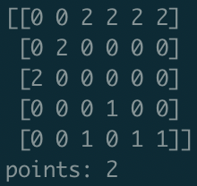

# Greedy Ant

```python
import numpy as np

def createBoard():
    rows = 6
    cols = 5
    board = [ [ 0 for i in range(rows) ] for j in range(cols) ]
    board = np.array(board)
    board[currentY][currentX] = 2
    return board

def setCandy(board, row, col):
    board[row][col] = 1

def moveAnt(board, points, currentY, currentX):
    for i in board:
        if currentY-1 > -1 and board[currentY-1][currentX+1]==1:
            points += 1
            currentY -= 1
        elif currentY+1 > -1 and board[currentY+1][currentX+1]==1:
            points += 1
            currentY += 1
        elif currentY > -1 and board[currentY][currentX+1]==1:
            points += 1

        currentX += 1
  	board[currentY][currentX] = 2
    return {'points': points, 'board': board }

#init vars
currentY = 2
currentX = 0
points = 0
board = createBoard()
candies = [ (0,2), (1,1), (3,3), (4,2), (4,4), (4,5) ]

for candy in candies:
    setCandy(board,candy[0],candy[1])

result = moveAnt(board, points, currentY, currentX)

print(result['board'])
print("points:", result['points'])
```
output:
